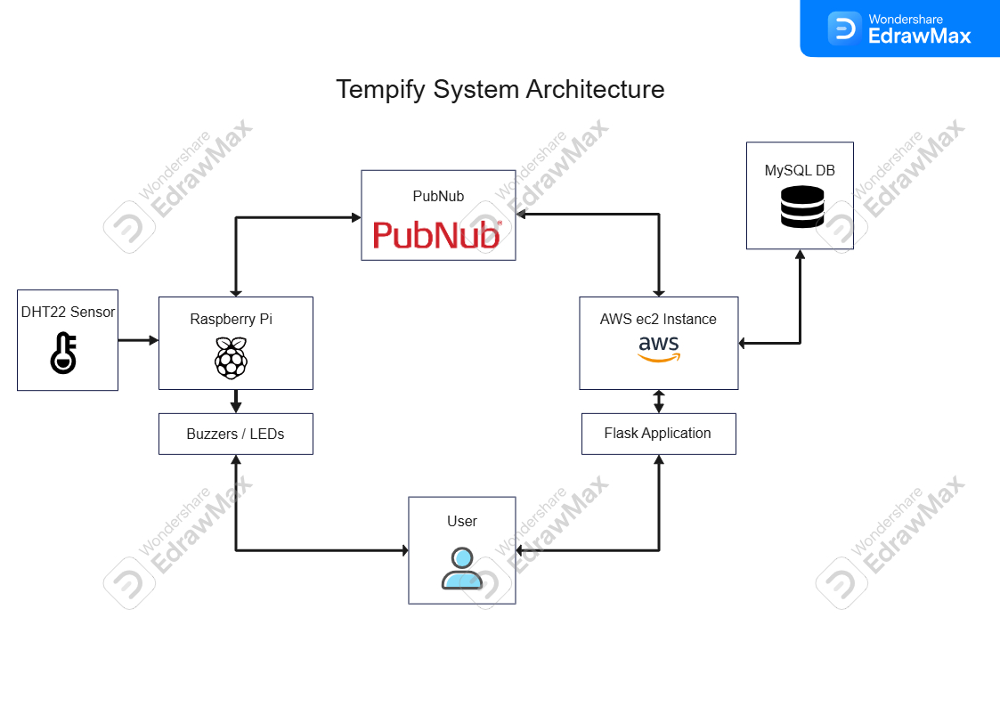
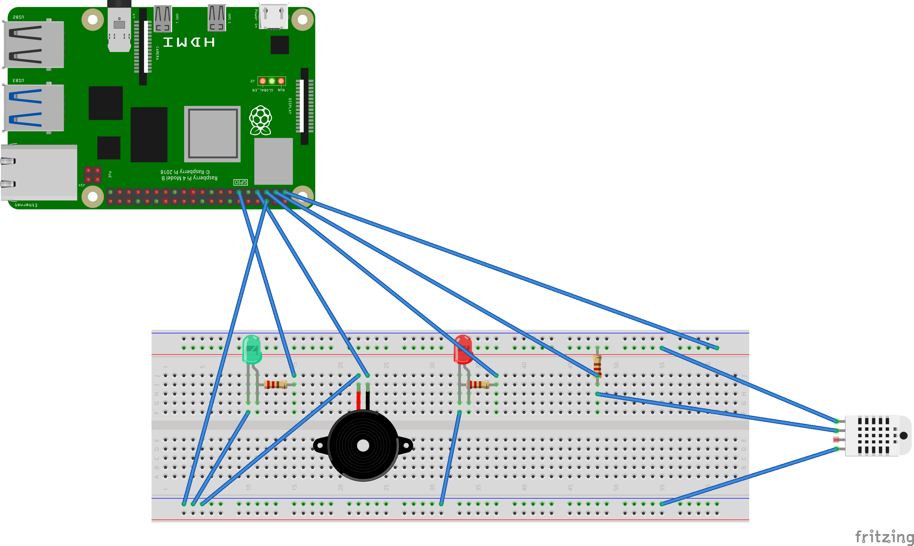
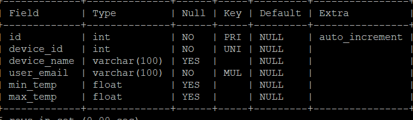
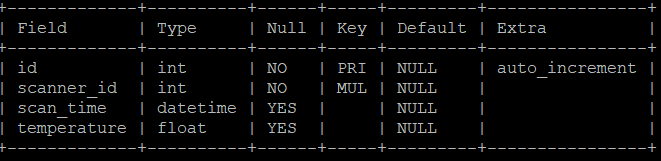

# Tempify
The site is hosted at https://tempify.xyz on an apache server, with a secure HTTPS connection.
Youtube Demo available at: https://youtu.be/PruTDi5rSHg
Github Repo: https://github.com/chealy90/iot_individual_project

Technologies:
- Python / Flask
- Raspberry Pi
- Apache Web Server
- PubNub channels
- Amazon Web Services ec2 instance
- MySQL
- HTML / CSS / JS / Jinja2

## Project idea:
Tempify is a temperature alert system to allow users to monitor the conditions inside their fridges and freezers.
Users simply place the scanner where they need it and can monitor the temperature in real time from a mobile device, in the event that the temperature goes outside of the permissable range, the device will physically alert the user through a buzzer and flashing light.
**Pi needs to be outside of fridge/freezer to prevent damage/corrosion**.

## System Architecture:

The hardware consists of a raspberry pi that interacts with a DHT22 sensor, piezo buzzer and LEDs.
The Flask app is hosted on an apache web server that runs on an AWS ec2 instance and provides users a site to monitor the temperature recorded by the DHT22 sensor, and set the max and min allowable temperature, these changes are sent to the raspberry pi when the user saves any changes, as well as to the application's database.
The ec2 instance stores the data it needs on a password protected MySQL cloud database.
Communication between the hardware and the Flask app is facilitated through PubNub.

The hardware used:
- Raspberry Pi 4
- Breadboard
- DHT22 Temperature and Humidity Sensor
- LEDs
- Piezo Buzzer
- Connecting wires and resistors

The temperature sensor records the ambient temperature, and controls the output devices (leds, and buzzer) according to the current maximum and minimum temperature flags. If the temperature is within the acceptable ranges, the green led will stay on constantly, if the temperature is outside the acceptable range, the piezo buzzer will buzz intermittently, and the red led fill flash every three seconds.

## Database
The MySQL database is password protected and consists of the following tables
app_user:

scanner:

scanner_reading

## Security
The Raspberry Pi and the Flask App hold any sensitive information in their .env files, such as pubnub info and database credentials.
The Flask app uses a secret key stored in the database to encrypt its session variables.
The database requires a password to login, and all user passwords are hashed before being sent to the database.

## References:
Snowflake icon by: https://www.flaticon.com/authors/dixit-lakhani-02
ChatGPT conversation: https://chatgpt.com/g/g-p-69442f0659fc81919af9d72ae8d3c95c-iot-individual-project/project